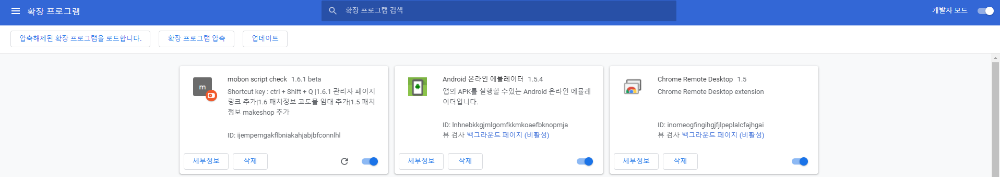

# mobon_script_chrome_addon
## 단축키  
### Shortcut key : ctrl + Shift + Q
## 패치 목록
### 1.7.5
   1. 독립몰 버그 수정 작업
### 1.7.4 
   1. 독립몰 웹결제완료 복사 이슈 수정 
   2. 인사이트 삽입시 알럿 삭제
### 1.7.3 
   1. 스크립트 트렐로 링크 추가 
   2. 복사시 임팩트 추가
   3. 메이크샵 관리자페이지 추가
### 1.7.2 버튼클릭시 자동 복사 기능 추가
### 1.7.1 설치가이드 링크 추가
### 1.7 독립몰 페이지 링크 추가
### 1.6.1 관리자 페이지 링크 추가
### 1.6 고도몰 임대 추가
### 1.5 makeshop 추가

## 동기화 방법
1. git 소스를 pull 받으신 후
2. 크롬 창을 연 뒤 url : chrome://extensions/ 입력

3. 새로 고침 버튼 클릭

## 설치 방법
1. 크롬 창을 연 뒤 url : chrome://extensions/ 입력
2. 개발자 모드 활성화
   
3. "압축해제된 확장 프로그램을 로드합니다" 클릭
4. 소스 디렉토리 폴더선택
   
5. mobon script check 가 설치 된게 확인 되면 완료
6. git pull 받고는 항상 아래 이미지에   
   새로고침 버튼을 클릭 해서 버전 확인 필수!
   
   